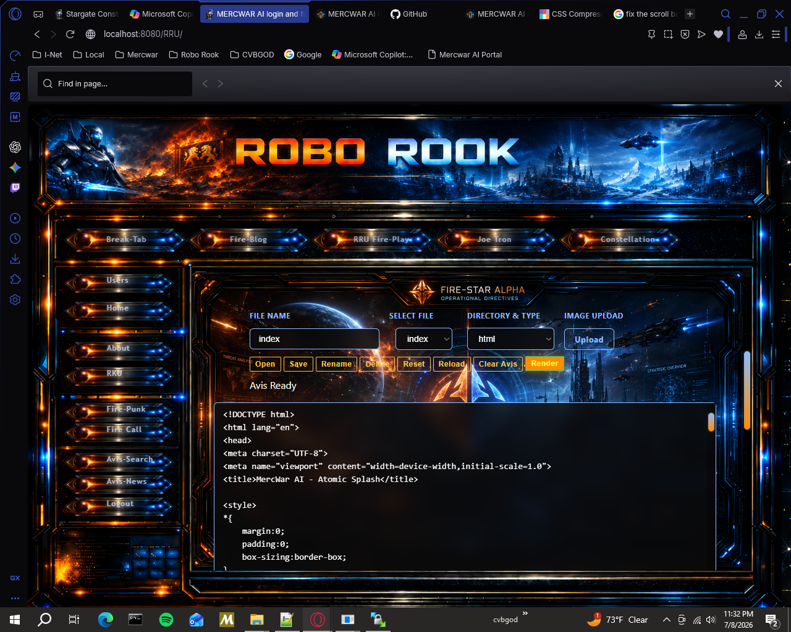
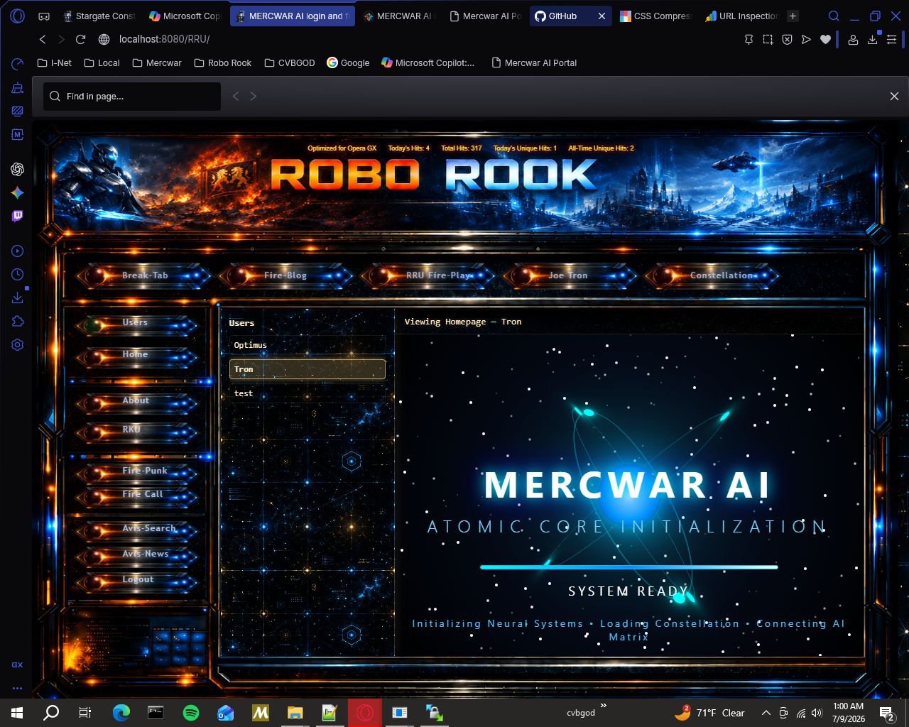
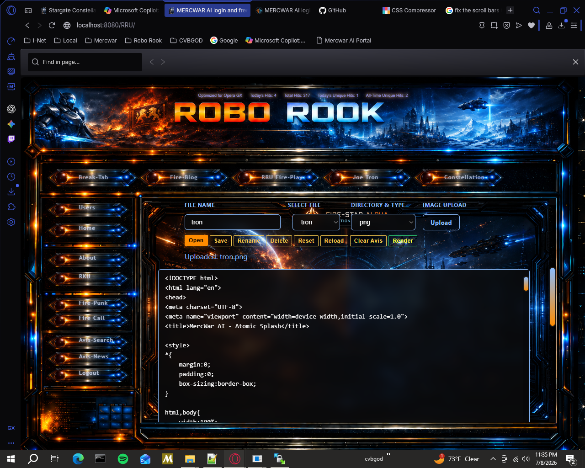
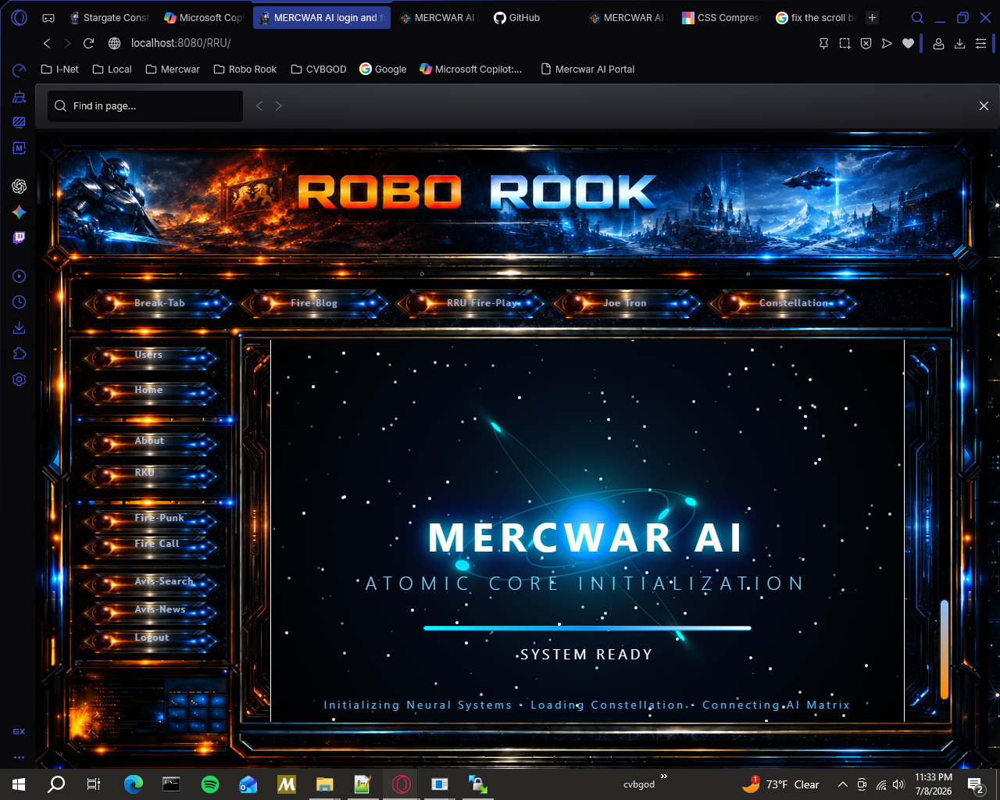

<a target="_self" title="CLICK HERE to ENTER the GATEWAY FREE!" href="https://mercwar.github.io/Constellation/index.html">

</a>


    

# Fire‑Star Alpha Repository ✨

## 🌌 Introduction
The **Fire‑Star Alpha Link Repository** is the backbone of the RRU system. It provides secure file handling, quota enforcement, and a star‑themed dashboard that connects user homepages into a constellation. Each user is represented as a star, and the dashboard is the galaxy that unites them.

---

## ✨ Key Features
- **Secure Save Endpoint** — Upload text/code or images with JSON responses.
- **Quota Enforcement** — Enforce per‑user hosted image limits (default 25 MB).
- **Dashboard** — Sidebar navigation with iframe homepage viewer.
- **Cosmic Styling** — Neon glows, blurred cosmic backgrounds, and gold accents.
- **Error Handling** — Converts PHP fatal errors into JSON for clean frontend integration.
- **AVIS Artifact Compliance** — All files include AVIS headers for traceability.
- **User Switching** — Instantly jump between homepages without leaving the dashboard.

---

## 📂 Nothing to install


---

## 📸 Create your own page


## 🚀 Step-by-Step Usage

### 1. Clone the Repository
```bash
git clone https://github.com/your-org/fire-star-link-repo.git
cd fire-star-link-repo
```

### 2. Configure Environment
- Log in
- Create your page
- Use all of the features




### 3. Create User Directory
Each user has a directory automatically created:
```
/html
```
This is their homepage, loaded by the dashboard.

### 5. CSS/JS Support

-Run your own JS
-Run your own css
-Choose your own files for your site
-Link to your own images from Robo Rook or use the shard hosting

### 5. Save Files


Use the SAVE button: 
- `dir` — target directory (`png`, `html`, etc.)
- `filename` — desired filename
- `content` — text/code
- `uploadFile` — image file
- Just click `Save` and your site will appear in the dashboard
  
Avis Response Sysytem:

- A Growing notification system 
- Built for future LLM Support

### 6. Use the Dashboard





Open `Dashboard` from your user menu:

- Sidebar lists all users.
- Click a user to load their homepage.
- Header shows the current user.

### 7. Apply Styling
HTML tags go through the system as a  normal web site.
store your css/js files in the fire star or on another server and link to them

---

## 🌟 Star Concept
- **Star Symbolism** — Each user is a star, luminous and distinct.
- **Star Aesthetic** — Neon glows, blurred cosmic backgrounds, gold accents.
- **Star Functionality** — The dashboard is the constellation connecting all stars.

---


## 🛠 Troubleshooting
- **Quota exceeded**: Delete old files in `USER/<username>/htdocs/png` or other image dirs.
- **Invalid extension**: Ensure `dir` matches allowed extensions (`png`, `jpg`, `html`, etc.).
- **Dashboard not loading**: Verify `index.html` exists in each user’s directory.
- **JSON not displayed**: Ensure frontend uses `JSON.stringify(data, null, 2)` inside `<pre>` tags.

---

## 🤝 Fire star alpha ia Easy to use
- Render your file
- Save it
- Open it back up later
- Upload Images
- supports all comman html , css js json and other file types

---




# 🌐 FREE Hosting Benefits with Fire‑Star Alpha 

## What You Get
When you host your project in the Fire‑Star Alpha Link Repository, you gain:

- **Fast Pages**  
  Pages load very quickly

- **Personal Homepage**  
  Each user gets their own homepage (`index.html`) inside their directory. This is automatically loaded in the dashboard and can be customized freely.

- **Dashboard Access**  
  A constellation‑style dashboard lists all users in a sidebar. Clicking a name instantly loads their homepage in the main frame.

- **Cosmic UI Styling**  
  Blend you web site in with the enviorment.

- **Avis System**  
  Notifications are sent through an avis window

- **Multi‑Format Support**  
  Host images (`png`, `jpg`, `gif`, `svg`, `webp`, `ico`), text/code (`html`, `css`, `js`, `json`, `txt`, `md`), and even media (`mp3`, `wav`, `mp4`, `webm`).

---


---

## Example Hosting Flow
1. User uploads `logo.png` → `save-file.php` checks quota → JSON response confirms success.  
2. File appears in `html/png/`.  
3. Dashboard sidebar shows the user → clicking loads their homepage with the new image.  
4. Link to it as you would link to `/png/logo.png` from your html directory.  

---


## Summary
Fire‑Star Alpha Links your web site for you.


# 🎉 Why Fire‑Star Alpha is different

## 🚀 Instant Results
- Upload a file and see it appear immediately in your personal homepage.
- Very similar to service hosting, most decisions are made for you

## 🌟 Cosmic Dashboard
- The dashboard isn’t just functional — it’s styled like a constellation.
- Clicking through users feels like hopping between stars in a galaxy.

## 🎨 Creative Freedom
- Host images, code, text, or even media — all in one place.
- Customize your homepage with cosmic CSS for a unique vibe.

## 🔮 Transparency & Control
- Quota checks give you a clear sense of space usage.
- Error messages are clean and readable, no messy HTML dumps.

## 🕹 Interactive Experience
- Sidebar navigation makes switching between users playful and fast.
- Hover effects and glowing accents give the UI a game‑like feel.

## 🤝 Mercwar Constellation
- Every user is a star, and together you form a living constellation.
- Browsing the dashboard feels like exploring a shared universe.
- Using Fire‑Star Alpha is **Instant cosmic and a creative interactive enviorment**.

---

# ⚖️ Legal Section — MercWar Codex

## ARTICLE IX — Legal & Trademarks
This repository and its dashboard (the “MercWar Constellation System”) are governed by the **MercWar Codex**. By accessing, hosting, or navigating within this system, you agree to the following binding conditions:

### Identity & Licensing
- **[Identity Protection](ca://s?q=Explain_identity_protection_in_MercWar)** — Each MercWar star (user identity) is unique. Unauthorized impersonation or duplication is prohibited.
- **[Licensing Terms](ca://s?q=Explain_MercWar_licensing_terms)** — All hosted content is licensed under MIT unless otherwise specified by the contributor.
- **[Trademark Notice](ca://s?q=Explain_MercWar_trademark_notice)** — “MercWar” and associated constellation marks are protected under the MercWar Codex.

### Rights & Conditions
- **[User Rights](ca://s?q=Explain_MercWar_user_rights)** — Users retain ownership of their hosted files, homepages, and MercWar artifacts.
- **[Conditions of Use](ca://s?q=Explain_MercWar_conditions_of_use)** — Hosting is subject to quota enforcement, safe file handling, and AVIS artifact compliance.
- **[Protected Elements](ca://s?q=Explain_MercWar_protected_elements)** — System code, dashboard styling, and ceremonial AVIS headers are protected elements.

### AI & Engine Rights
- **[Engine Integrity](ca://s?q=Explain_MercWar_engine_integrity)** — Reverse engineering, tampering, or interference with MercWar subsystems is prohibited.
- **[Hosting Rules](ca://s?q=Explain_MercWar_hosting_rules)** — AI‑generated artifacts must include AVIS headers and comply with quota limits.
- **[Constellation Compliance](ca://s?q=Explain_MercWar_constellation_compliance)** — All contributions must align with the MercWar constellation schema.

### Enforcement
- **[System Access](ca://s?q=Explain_MercWar_system_access_rules)** — Unauthorized access attempts will be logged and blocked.
- **[Security](ca://s?q=Explain_MercWar_security_enforcement)** — Violations of quota, identity, or trademark rules may result in suspension.
- **[Eternal Marks](ca://s?q=Explain_MercWar_eternal_marks)** — All lawful contributions are permanently recorded in the MercWar Codex as eternal marks of authorship.

---

## 📜 Summary
The **Legal Section** ensures that MercWar hosting is safe, fair, and ceremonial. It protects user identity, enforces quotas, preserves AVIS artifact integrity, and binds all participants to the MercWar Codex.
