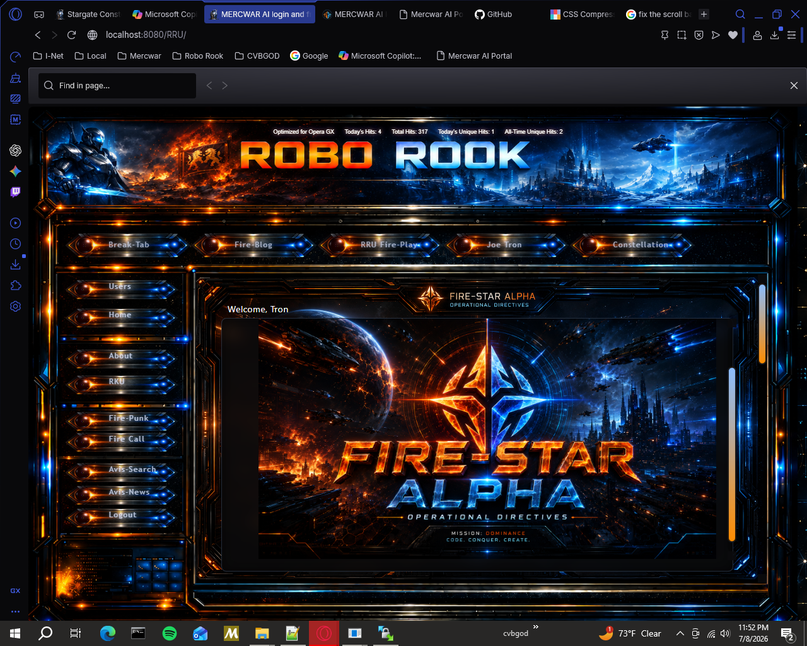
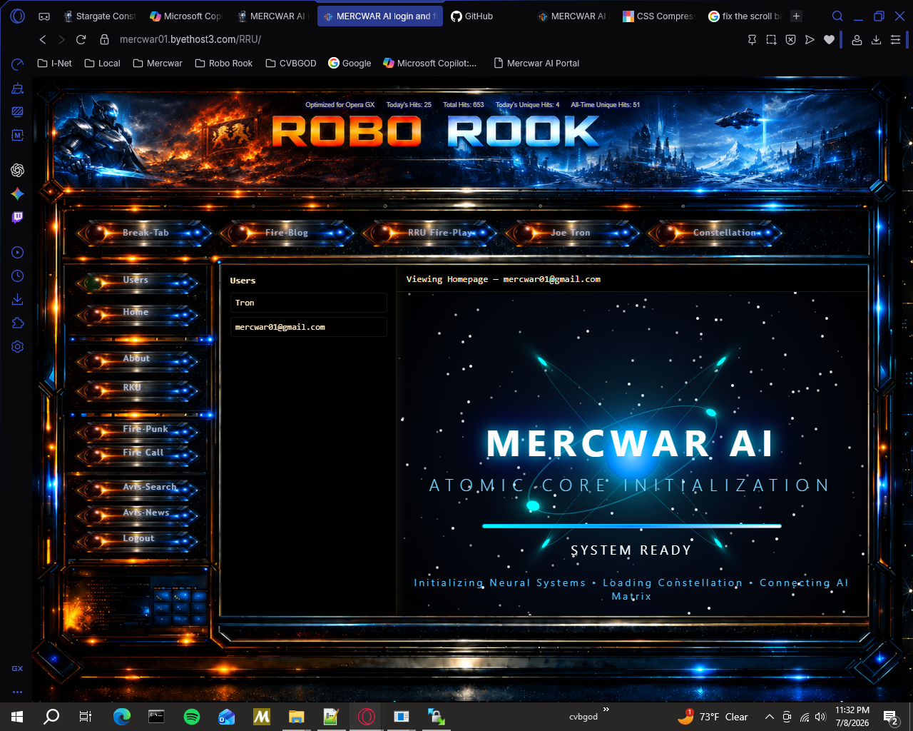
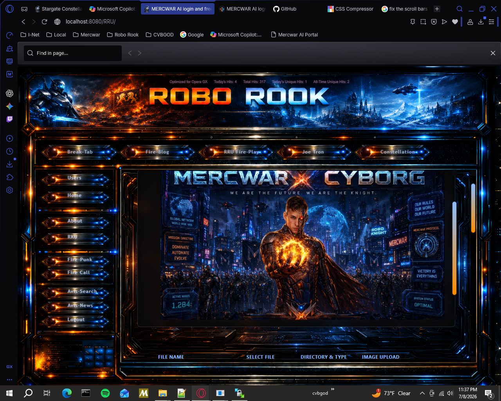

<a target="_self" title="CLICK HERE to ENTER the GATEWAY FREE!" href="https://mercwar.github.io/Constellation/index.html">

</a>


    

# Fire‑Star Alpha Link Repository ✨

## 🌌 Introduction
The **Fire‑Star Alpha Link Repository** is the backbone of the RRU system. It provides secure file handling, quota enforcement, and a star‑themed dashboard that connects user homepages into a constellation. Each user is represented as a star, and the dashboard is the galaxy that unites them.

---

## ✨ Key Features
- **Secure Save Endpoint** — Upload text/code or images with JSON responses.
- **Quota Enforcement** — Enforce per‑user hosted image limits (default 25 MB).
- **Dashboard** — Sidebar navigation with iframe homepage viewer.
- **Cosmic Styling** — Neon glows, blurred cosmic backgrounds, and gold accents.
- **Error Handling** — Converts PHP fatal errors into JSON for clean frontend integration.
- **AVIS Artifact Compliance** — All files include AVIS headers for traceability.
- **User Switching** — Instantly jump between homepages without leaving the dashboard.

---

## 📂 Nothing to install

---

## 📸 Create your own page



## 🚀 Step-by-Step Usage

### 1. Clone the Repository
```bash
git clone https://github.com/your-org/fire-star-link-repo.git
cd fire-star-link-repo
```

### 2. Configure Environment
- Install PHP 7.4+ or newer.
- Set `$google_user` in your session/auth system.
- Ensure `RRU-AI/USER/` exists for user homepages.


### 3. Create User Directory
Each user has:
```
USER/<username>/htdocs/html/index.html
```
This is their homepage, loaded by the dashboard.

### 4. Enforce Quota
Include `checkImageCap.php`:
```php
include_once('checkImageCap.php');
if (!checkImageCap($google_user, 25600)) {
    echo json_encode(["status" => "error", "message" => "Quota exceeded"]);
    exit;
}
```


### 5. Save Files
Use `save-file.php` with POST payloads:
- `dir` — target directory (`png`, `html`, etc.)
- `filename` — desired filename
- `content` — text/code
- `uploadFile` — image file

Response example:
```json
{"status":"success","file":"logo.png","dir":"png"}
```



### 6. Use the Dashboard
Open `dashboard.php`:
- Sidebar lists all users.
- Click a user to load their homepage.
- Header shows the current user.

### 7. Apply Styling
Link `create-home.css` for unified UI.

---

## 🌟 Star Concept
- **Star Symbolism** — Each user is a star, luminous and distinct.
- **Star Aesthetic** — Neon glows, blurred cosmic backgrounds, gold accents.
- **Star Functionality** — The dashboard is the constellation connecting all stars.

---


## 🛠 Troubleshooting
- **Quota exceeded**: Delete old files in `USER/<username>/htdocs/png` or other image dirs.
- **Invalid extension**: Ensure `dir` matches allowed extensions (`png`, `jpg`, `html`, etc.).
- **Dashboard not loading**: Verify `index.html` exists in each user’s directory.
- **JSON not displayed**: Ensure frontend uses `JSON.stringify(data, null, 2)` inside `<pre>` tags.

---

## 🤝 Contributing
- Fork the repo.
- Create a feature branch.
- Submit pull requests with clear descriptions.
- Follow AVIS artifact conventions.

---

## 📜 License
Licensed under the MIT License. See LICENSE file for details.

---

Explore the Fire‑Star Alpha documentation for deeper integration notes.

Here’s a **massive README section** that describes exactly what users get from hosting with the Fire‑Star Alpha Link Repository. It’s written in GitHub‑style, with clear breakdowns of benefits and features:

# 🌐 Hosting Benefits with Fire‑Star Alpha Link Repository

## What You Get
When you host your project in the Fire‑Star Alpha Link Repository, you gain:

- **Secure File Hosting**  
  Every file is saved through `save-file.php`, which enforces safe writes, validates extensions, and returns clean JSON responses.

- **Quota Management**  
  Each account has a configurable storage cap (default 25 MB for images). This ensures fair usage and prevents runaway storage consumption.

- **Personal Homepage**  
  Each user gets their own homepage (`index.html`) inside their directory. This is automatically loaded in the dashboard and can be customized freely.

- **Dashboard Access**  
  A constellation‑style dashboard lists all users in a sidebar. Clicking a name instantly loads their homepage in the main frame.

- **Cosmic UI Styling**  
  Unified CSS (`create-home.css`) applies neon glows, blurred cosmic backgrounds, and subtle gold accents for a futuristic look.

- **Error Transparency**  
  Fatal PHP errors are converted into JSON messages, so you never see raw HTML error dumps — only clean, parseable responses.

- **Multi‑Format Support**  
  Host images (`png`, `jpg`, `gif`, `svg`, `webp`, `ico`), text/code (`html`, `css`, `js`, `json`, `txt`, `md`), and even media (`mp3`, `wav`, `mp4`, `webm`).

---

## Why It Matters
- **Fairness** — Quota enforcement keeps hosting balanced across all users.  
- **Security** — Safe file handling prevents invalid writes and extension abuse.  
- **Community** — The dashboard connects everyone’s homepage into one constellation.  
- **Style** — Cosmic UI makes the environment feel futuristic and inspiring.  

---

## Example Hosting Flow
1. User uploads `logo.png` → `save-file.php` checks quota → JSON response confirms success.  
2. File appears in `USER/<username>/htdocs/png/`.  
3. Dashboard sidebar shows the user → clicking loads their homepage with the new image.  
4. Styling from `create-home.css` ensures consistent look across all hosted content.  

---

## Summary
Hosting with Fire‑Star Alpha Link Repository means you don’t just get storage — you get a **secure, styled, quota‑aware constellation** where every user is a star and the dashboard is the galaxy that unites them.

Here’s the **fun‑focused README section** you asked for — instead of dry technical details, it highlights why using the Fire‑Star Alpha Link Repository feels exciting and enjoyable:


# 🎉 Why It’s Fun to Use Fire‑Star Alpha Hosting

## 🚀 Instant Gratification
- Upload a file and see it appear immediately in your personal homepage.
- JSON responses make every save feel like a “mission success” ping.

## 🌟 Cosmic Dashboard
- The dashboard isn’t just functional — it’s styled like a constellation.
- Clicking through users feels like hopping between stars in a galaxy.

## 🎨 Creative Freedom
- Host images, code, text, or even media — all in one place.
- Customize your homepage with cosmic CSS for a unique vibe.

## 🔮 Transparency & Control
- Quota checks give you a clear sense of space usage.
- Error messages are clean and readable, no messy HTML dumps.

## 🕹 Interactive Experience
- Sidebar navigation makes switching between users playful and fast.
- Hover effects and glowing accents give the UI a game‑like feel.

## 🤝 Community Constellation
- Every user is a star, and together you form a living constellation.
- Browsing the dashboard feels like exploring a shared universe.

---

### TL;DR
Using Fire‑Star Alpha hosting is fun because it’s **instant, cosmic, creative, transparent, interactive, and communal**. It’s not just storage — it’s an experience.
